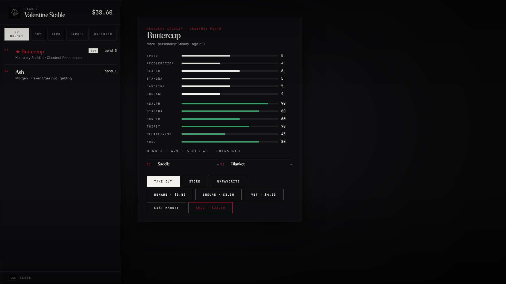

# lxr-horses — Horses & Stables for LXRCore

A horse is a character on The Land of Wolves. It has a name, a temperament,
cores that drain and fill, a bond that grows with care and breaks with
neglect, tack that changes what it can do, and papers that say who owns it.

## What it does

* **Ownership** — horses are records the server owns (`lxr_horses`). Limits per
  character and per job, favourites, one active horse, papers (`horse_deed`),
  transfer to another player with a consent prompt, insurance, permanent or
  stable death.
* **Stables** — vanilla NUI in the LXR theme at every town stable: buy from the
  town's stock (the core catalog decides who sells what), sell, rename, fit tack,
  insure, veterinary, take out / stable, player market with tax, breeding.
* **Cores & bonding** — hunger, thirst, cleanliness, mood, health, stamina tick on
  the server; feeding, brushing, patting and riding raise the bond; neglect
  costs it and eventually injures the horse. Bond gates whistle range, stat
  bonuses and temperament drift.
* **Catalog-driven** — breeds, coats, stats, prices and town availability from
  `lxr-core/shared/horses.lua`; feed, tonics and brushes from the item catalog
  (`effects.horse_*`); every price from the 1899 ledger.
* **Tack** — 546 game components in `shared/tack.lua` grouped by slot, with
  labels, prices, tiers and stat bonuses overridable in `Config.TackOverrides`.
* **Wild herds** — region herds with rare coats, lasso-and-ride taming, a
  horsemanship skill gate, registration fee and daily limits at the stable.
* **Training** — checkpoint courses that raise a trained stat and the bond.
* **Doings** — graze, drink at water, rest, rear: bond-gated cards on the horse (lxr-interact), each fills cores and earns bond with the game's own animations. `Config.Actions`.
* **Hand-over** — offer a horse to the closest player for a price or as a gift; tack and saddlebags move with it. `Config.Trade`.
* **Breeding** — stallion + mare at a stable, gestation, foal stats inherited.
* **Saddlebags** — a stash on the horse through lxr-inventory with owner, job
  and lawman search rules.
* **Overhead tag**, mounted shortcuts, admin `/givehorse`, exports
  (`GetActiveHorse`, `GetOwnedHorses`, `IsHorseOwnedBy`, `AddBond`).

## Events (server)

`lxr:horse:spawned`, `lxr:horse:stored`, `lxr:horse:died`, `lxr:horse:injured`,
`lxr:horse:interact`, `lxr:horse:bond`, `lxr:horse:bought`, `lxr:horse:sold`,
`lxr:horse:market`, `lxr:horse:transferred`, `lxr:horse:tamed`,
`lxr:horse:claimed`, `lxr:horse:trained`, `lxr:horse:bred`.

Every owned horse entity carries the state bag `lxr:horse`
(`{ id, owner, name, bond, personality, cores, stats, tack, injured }`).

## Security

The server re-checks every claim on its own copy of the entity: model, position,
health, rider distance; only the owner can call, sell, rename or fit tack;
strangers can feed or pat but never earn the owner's bond; stable actions
require being at the stable; wild catches are only horses the server spawned;
training times are sanity-checked; every net event is rate limited and every
refusal is logged as an exploit attempt through lxr-core.

## Tests

`lua tests/run.lua` (needs `../lxr-core`) — tack catalog integrity, records,
bond levels, effective stats, value, core ticks, item effects, personality
drift, breeding. Natives and in-game behaviour are **NOT TESTED** on a live
server yet; stable and preview coordinates in `config.lua` are approximate.

## Configuration

Everything is in `config.lua`. Nothing in `client/` or `server/` needs editing.

© 2026 iBoss21 / LXRCore | lxrcore.com | All Rights Reserved — see LICENSE.
